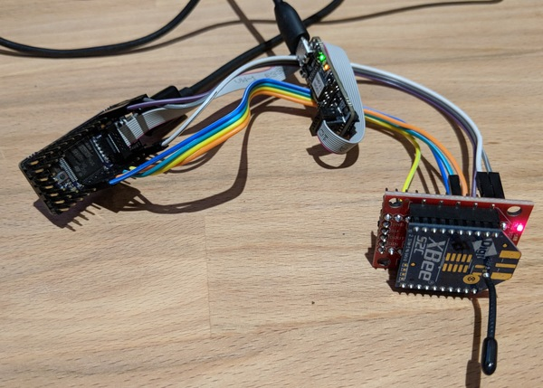

## xbee-spi -- Buffered SPI to USB UART bridge for XBee modules.

The XBee modules from Digi (e.g. the S2C ZigBee module I'm using for HA projects) have both a UART and a SPI interface. This is simple firmware for an STM32F4 to act as a SPI->USB bridge (i.e. performs roughly the same functionality as the FTDI chip on a regular XBee breakout board). It also works with XCTU.

### Why?
As explained in the XBee documentation, when the XBee->Host buffer is full, the module will drop incoming frames. Not only are the buffers tiny, but the UART runs at a maximum baud rate of 115200bps, but ZigBee can transmit data at 250kbit. When lots of devices are sending messages on the network at the same time, the buffer can easily overflow. A good example of this is a roomfull of lightbulbs being turned on at the same time, sending their `Device Announce` ZDO.

The SPI interface can run up to 5Mbit, so in theory it should be possible to drain the xbee->host buffer faster using SPI, and use a bigger buffer.

This is written for the STM32F4 (specifically a 1Bitsy board) because it's what I had on hand, but it's quite overpowered for this task! I'm using a [SparkFun XBee Explorer Regulated](https://www.sparkfun.com/products/11373) which just adds an LDO and status LEDs, and connecting the SPI+nATTN pins to the 1Bitsy. Previously (and what this replaces) was a [SparkFun XBee Explorer USB][https://www.sparkfun.com/products/11373] which has a FTDI-based USB UART interface.

### But does it work?
Maybe! This was an intermittent problem to begin with, so far I haven't seen a dropped announce ZDO.

One easy test is to send a bunch of AT commands (via API frames) and ensure they all get replied to. e.g. send 6 commands, and wait for replies. This definitely shows an improvement over the FTDI breakout.

### XBee SPI
The XBee acts as a SPI slave with a nATTN line to indicate that the master should read. The nATTN line can be asserted mid-transmit (i.e. it doesn't use the nSS line to delimit transactions), so a transmit and receive can overlap arbritrarily.

This firmware will run the SPI clock whenever there are bytes to send Host->XBee or while the XBee is asserting nATTN. This means that we end up receiving a lot of "undefined" bytes from the XBee but the frame detection will filter them out before sending to the host.

### Notes
- The SPI interface always forces API mode 1 (no escaping). XCTU always sends the AP command as its first query, so it deals with this fine.
- XCTU will fail to connect to a device that sends invalid bytes outside of valid frames (i.e. it doesn't ignore non-frame data), so the firmware has some very basic frame parsing to deal with this. Other APIs (e.g. `python-xbee`) just handle this.

